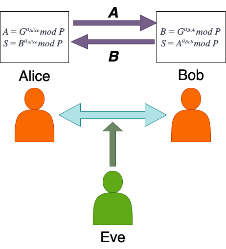

# Diffie-Hellman Key Exchange
Diffie-Hellman key exchange is a cryptographic protocol that allows two parties to securely exchange information over an public (i.e. insecure) channel. The shared secret can then be used to establish a secure communication channel, such as for encrypting data or authenticating messages. The Diffie-Hellman key exchange algorithm was developed in 1976 and is widely used in modern cryptographic protocols.

## Implementing Diffie-Hellman Key Exchange
Imagine a situation where Alice and Bob want to communicate securely over an insecure channel, and Eve is eavesdropping on their conversation.
The first part of the exchange begins with an agreed-upon function of the form $G^a mod P$. This formula is known to all parties.

The communicators will agree on the same number to fulfil $G$ and $P$. $P$ must be a prime number. In a real implementation, these numbers will be very large; the larger number is, the more difficult it is to crack the exchange using a brute-force attack.

In this example, let $G=23 \text{ and } P=17$
$a$ is part of the secret key. Alice and Bob each choose a secret key privately and run the function. Let $a_{Alice} = 5 \text{ and } a_{Bob} = 8$.

Now Alice and Bob run their respective functions with their secret numbers. 
$$
A = G^{a_{Alice}} mod P = 23^5 mod 17 = 7
\newline
B = G^{a_{Bob}} mod P = 23^8 mod 17 = 16
$$

Even though Eve knows the equation and can see the results, she is unable to determine the secret numbers of Alice and Bob. This is because the function is a one-way function, which means that it is easy to calculate the result given the inputs, but it is computationally infeasible to determine the inputs given the result. This specific case is known as the [Discrete Logarithm Problem (DLP)](https://en.wikipedia.org/wiki/Discrete_Logarithm_Problem_%28DLP%29).

The final part of the exchange is where Alice and Bob each run a new function using the result they got from the other, along with their own secret number and the original prime modulus, *and arrive at a common shared secret number*, which Eve is unable to determine.
$$
\text{For Alice, } S = B^{a_{Alice}} mod P
\newline
S = 16^5 mod 17 = 16
\newline
\text{For Bob, } S = A^{a_{Bob}} mod P
\newline
S = 7^8 mod 17 = 16
$$
S is now the shared secret key.

You may be wondering why the shared secret key is the same for both Alice and Bob. This can be proven mathematically using the properties of modular arithmetic.
$$
\text{For Alice, } S = B^{a_{Alice}} mod P
\newline
S = (G^{a_{Bob}} mod P)^{a_{Alice}} mod P \text{ (by substituting the value of B)}
\newline
S = (G^{a_{Bob} \cdot a_{Alice}}) mod P \text{ (by the properties of modular arithmetic)}
\newline
S = (G^{a_{Alice} \cdot a_{Bob}}) mod P \text{ (by the commutative property of multiplication)}
\newline
S = (G^{a_{Alice}} mod P)^{a_{Bob}} mod P \text{ (by the properties of modular arithmetic)}
\newline
S = A^{a_{Bob}} mod P \text{ (by substituting the value of A)}
\newline
\text{which is the same as the shared secret key for Bob.}
$$

# Elliptic Curve Diffie-Hellman (ECDH)
## What is Elliptic Curve Diffie-Hellman (ECDH)?
Elliptic Curve Diffie-Hellman (ECDH) is a variant of the Diffie-Hellman key exchange algorithm that uses elliptic curve cryptography to establish the shared secret between two parties. ECDH is widely used in modern cryptographic protocols, such as TLS, to securely negotiate a shared key for encryption and authentication.

ECDH differs from Diffie–Hellman Key Exchange by using elliptic curve cyrptography multiplication, rather than modular exponentiations. 

## Implementing Elliptic Curve Diffie-Hellman (ECDH)
$a$ and $b$ are the private keys of the two parties, and $G$ is a generator point on the elliptic curve. The private keys are a randomly selected integer between 1 and the order of the generator point.

Therefore, the public keys of the two parties are $aG$ and $bG$. The public key is calculated by performing point doubling and point addition operations on the generator point $G$ for the number of times specified by the private key of both parties (i.e. $a$ times for Alice and then $b$ times for Bob).

$$
\text{For Alice, the shared key is } S =  aP_{Bob}
\newline
\text{where } P_{Bob} = bG
\newline
\text{Therefore, } S = a(bG) = b(aG)
\newline
\text{which is the same as the shared secret key for Bob.}
$$

Again, the shared secret key is the same for both parties, and it is used to establish a secure communication channel between them.
# Analysis of Diffie-Hellman Key Exchange
## Advantages
1. **Secure Key Exchange**: Diffie-Hellman key exchange allows two parties to securely establish a shared secret over an insecure channel.
2. **Perfect Forward Secrecy**: Diffie-Hellman key exchange provides perfect forward secrecy, meaning that even if an attacker compromises the long-term private keys of the parties, they cannot decrypt past communications.

## Disadvantages
1. **Vulnerable to Man in the Middle Attacks**: Diffie-Hellman key exchange is vulnerable to man-in-the-middle attacks, which is where an attacker intercepts and alters the communication between the parties. This can be mitigated by using additional security measures, such as digital signatures or certificates.
2. **Computational Overhead**: Diffie-Hellman key exchange can be computationally intensive, especially for large prime numbers or elliptic curves. This can impact the performance of the communication channel.

# Summary
The Diffie-Hellman key exchange algorithm is a fundamental building block of modern cryptography, as it allows two parties to securely establish a shared secret over an insecure channel. The algorithm is widely used in protocols such as TLS, SSH, and IPsec.

This technique is also used in establishing end to end encryption in messaging apps like Messenger and WhatsApp. 
You can read more about end to end encryption in my [blog post](/end-to-end-encryption).